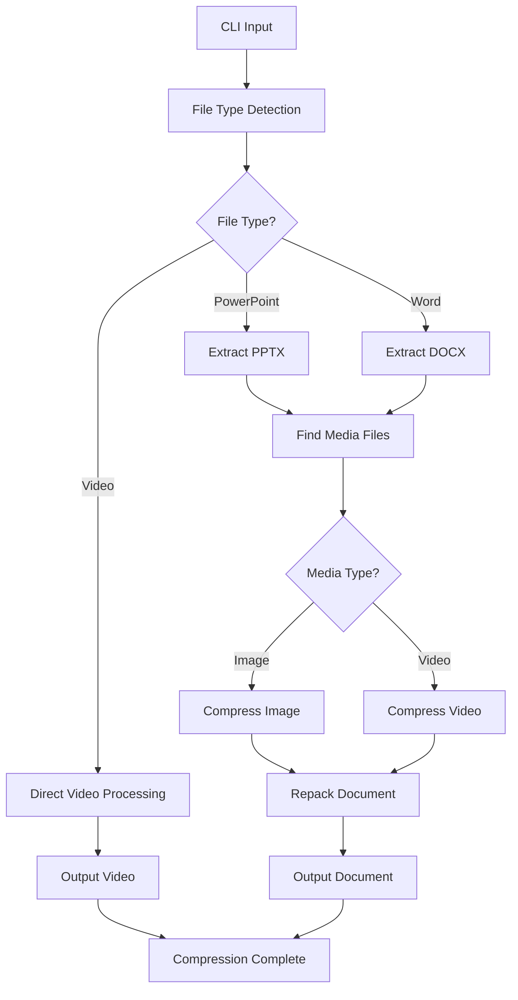

# Deck Compress Architecture

## Project Structure

```
deck-compress/
├── src/                          # Source code
│   └── deck_compress.py         # Main application module
├── tests/                        # Test suite
│   ├── __init__.py              # Test package init
│   └── test_deck_compress.py    # Comprehensive test suite
├── docs/                         # Documentation
│   └── index.html               # Landing page
├── config/                       # Configuration files
│   └── requirements.txt         # Python dependencies
├── run_tests.py                 # Test runner script
├── pytest.ini                  # Pytest configuration
├── README.md                    # Project documentation
├── ARCHITECTURE.md              # This file
└── TODO.md                      # Task tracking
```

## Core Architecture

### Module Organization

The application follows a modular architecture with clear separation of concerns:

#### 1. Error Handling Module
- **`ErrorType`**: Enum defining error categories
- **`AppError`**: Custom exception class with context
- **`Result[T, E]`**: Rust-like Result type for error handling
- **Utility functions**: `file_error()`, `compression_error()`, etc.

#### 2. Progress Tracking Module
- **`CompressionProgress`**: Simple progress tracker
- **`show_compression_summary()`**: Summary display function

#### 3. Tools Validation Module
- **`ToolInfo`**: External tool metadata
- **`ToolValidator`**: Tool availability checking
- **Tool definitions**: FFmpeg, Ghostscript, ImageMagick, LibreOffice

#### 4. Compression Engine
- **Image compression**: `compress_image()`
- **Video compression**: `compress_video()`, `compress_standalone_video()`
- **Document processing**: `compress_doc()`, `process_pptx()`
- **File processing**: `process_single_file()`, `process_folder()`

#### 5. CLI Interface
- **`main()`**: Command-line argument parsing
- **Argument validation**: File types, quality ranges, etc.

## Data Flow



## Error Handling Strategy

The application uses a comprehensive error handling system:

1. **Result Types**: All operations return `Result[T, AppError]`
2. **Error Context**: Errors include file paths, operations, and details
3. **Error Chaining**: Source errors are preserved for debugging
4. **Graceful Degradation**: Non-critical failures don't stop processing

## Progress Tracking

Simple, focused progress tracking:
- File-level progress for single files
- Batch progress for folder processing
- Compression ratio reporting
- Time tracking

## External Dependencies

### Required Tools
- **FFmpeg**: Video compression and format conversion
- **Python libraries**: Pillow, Rich, pytest

### Optional Tools
- **Ghostscript**: PDF processing (removed from current version)
- **ImageMagick**: Advanced image processing
- **LibreOffice**: Document conversion

## Testing Architecture

### Test Organization
- **Unit tests**: Individual function testing
- **Integration tests**: End-to-end workflow testing
- **Error scenario tests**: Failure case handling
- **Tool validation tests**: External dependency checking

### Test Categories
- `unit`: Basic unit tests
- `compression`: Compression functionality
- `error_handling`: Error scenarios
- `progress`: Progress tracking
- `integration`: Full workflow tests

## Performance Considerations

1. **Memory Management**: Temporary files for large operations
2. **Timeout Handling**: Prevents hanging on corrupted files
3. **Batch Processing**: Efficient folder processing
4. **Progress Feedback**: Real-time user feedback

## Security Considerations

1. **File Validation**: Input file type checking
2. **Path Sanitization**: Safe file path handling
3. **Temporary Files**: Secure temporary directory usage
4. **Error Information**: No sensitive data in error messages

## Future Extensibility

The modular architecture supports easy extension:
- New file types can be added to the processing pipeline
- New compression algorithms can be integrated
- Additional progress tracking can be implemented
- New external tools can be added to the validation system
