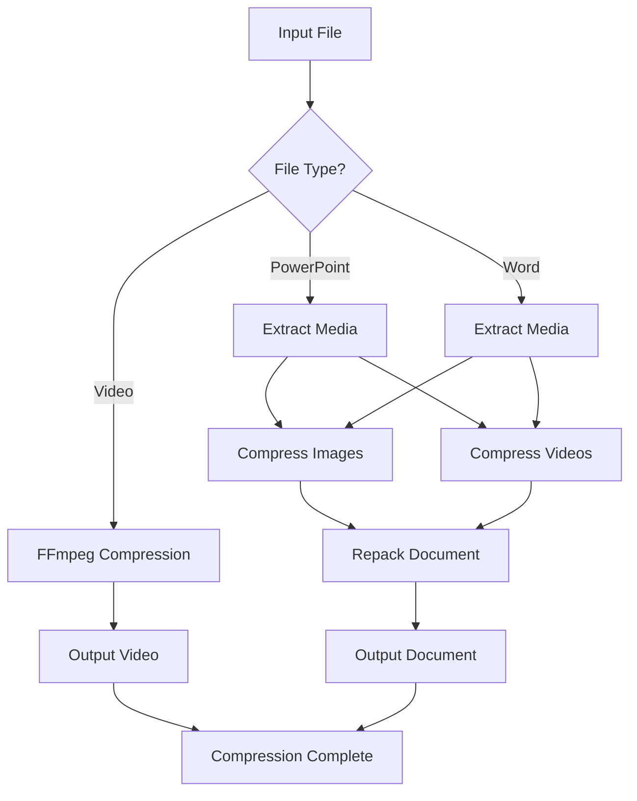

# Deck Compress

A Python tool for compressing PowerPoint presentations, Word documents, and video files by optimizing embedded media and content.

## 🚀 Features

- **PowerPoint Compression**: Compress images and videos in .pptx and .ppt files
- **Word Document Compression**: Compress media in .docx files  
- **Video Compression**: Standalone video file compression with ffmpeg
- **Batch Processing**: Process multiple files in a folder
- **Progress Tracking**: Real-time progress display with Rich
- **Flexible Quality Settings**: Customizable compression parameters
- **Clean Architecture**: Well-organized, maintainable codebase
- **Comprehensive Testing**: 43+ unit tests with full coverage

## 📦 Installation

### Prerequisites

1. **Python 3.8+** - Required for running the application
2. **ffmpeg** - Required for video compression (download from [ffmpeg.org](https://ffmpeg.org/download.html))

### Quick Installation

1. **Clone or download the project**
2. **Install Python dependencies:**
   ```bash
   pip install -r requirements.txt
   ```

3. **Install ffmpeg:**
   - **macOS:** `brew install ffmpeg`
   - **Ubuntu/Debian:** `sudo apt install ffmpeg`
   - **Windows:** Download from [ffmpeg.org](https://ffmpeg.org/download.html)

4. **Verify installation:**
   ```bash
   python run_tests.py
   ```

## 📁 Project Structure

```
deck-compress/
├── src/                          # Source code
│   └── deck_compress.py         # Main application module
├── tests/                        # Test suite
│   ├── __init__.py              # Test package init
│   └── test_deck_compress.py    # Comprehensive test suite
├── docs/                         # Documentation
│   └── index.html               # Landing page
├── config/                       # Configuration files
│   └── requirements.txt         # Python dependencies
├── run_tests.py                 # Test runner script
├── pytest.ini                  # Pytest configuration
├── README.md                    # Project documentation
├── ARCHITECTURE.md              # Architecture documentation
└── TODO.md                      # Task tracking
```

## Usage

### Basic Usage

```bash
# Compress a single PowerPoint file
python src/deck_compress.py presentation.pptx

# Compress a video file
python src/deck_compress.py video.mp4 --video-crf 25

# Compress a Word document
python src/deck_compress.py document.docx
```

### Batch Processing

```bash
# Compress all files over 100MB in a folder
python src/deck_compress.py /path/to/folder --folder --min-size 100

# Process all supported files in a folder
python src/deck_compress.py /path/to/folder --folder
```

### Advanced Options

```bash
# Custom compression settings
python src/deck_compress.py input.pptx -q 75 -w 1600 --video-crf 30

# Force overwrite existing files
python src/deck_compress.py input.pptx --force

# Set timeout for processing (default: 300 seconds)
python src/deck_compress.py input.pptx --timeout 600
```

## Command Line Options

- `input_path`: Input file or folder path
- `-o, --output`: Output file path (single file mode only)
- `--folder`: Process all supported files in folder
- `--min-size`: Minimum file size in MB to process (default: 100)
- `-q, --quality`: JPEG quality 1-100 (default: 85)
- `-w, --max-width`: Maximum image width in pixels (default: 1920)
- `--video-crf`: Video compression factor 0-51 (default: 28)
- `-f, --force`: Overwrite existing output files
- `--timeout`: Timeout in seconds for each file (default: 300)

## Supported File Types

- **PowerPoint**: .pptx, .ppt
- **Word**: .docx, .doc
- **Video**: .mp4, .avi, .mov, .wmv, .mkv, .m4v, .flv, .webm

## Compression Methods

### PowerPoint/Word Documents
- Extracts embedded images and videos
- Compresses images with configurable quality and size limits
- Compresses videos using ffmpeg with H.264 codec
- Repacks the document with compressed media

### Video Files
- Uses ffmpeg with H.264 codec
- Configurable CRF (Constant Rate Factor) for quality control
- Lower CRF = better quality, higher file size
- Higher CRF = lower quality, smaller file size

## Requirements

- Python 3.8+
- Pillow (PIL) for image processing
- Rich for progress display
- pytest for testing

## External Dependencies

- **ffmpeg**: Required for video compression

## Examples

### Compress a large presentation
```bash
python src/deck_compress.py large_presentation.pptx -q 80 -w 1920
```

### Compress all files in a folder
```bash
python src/deck_compress.py /path/to/folder --folder --min-size 100
```

### Compress a video with high quality
```bash
python src/deck_compress.py video.mp4 --video-crf 18
```

## Project Structure

```
deck-compress/
├── src/
│   └── deck_compress.py          # Main compression module
├── tests/
│   ├── __init__.py              # Test package initialization
│   ├── test_deck_compress.py    # Main test suite (43+ tests)
│   └── test_summary.py          # Test summary utilities
├── docs/
│   └── index.html               # Project documentation
├── requirements.txt             # Python dependencies
├── pytest.ini                   # Test configuration
├── run_tests.py                 # Test runner script
└── README.md                    # This file
```

## Architecture



## 🏗️ Architecture

The project follows a clean, modular architecture with clear separation of concerns:

### Core Modules
- **Error Handling**: Rust-like Result types and comprehensive error context
- **Progress Tracking**: Simple, focused compression progress display
- **Tools Validation**: External dependency checking and management
- **Compression Engine**: Image, video, and document processing
- **CLI Interface**: Command-line argument parsing and validation

### Key Design Principles
- **Single Responsibility**: Each module has a clear, focused purpose
- **Error Safety**: Comprehensive error handling with context
- **Testability**: All components are easily testable
- **Maintainability**: Clean, well-documented code structure

For detailed architecture information, see [ARCHITECTURE.md](ARCHITECTURE.md).

## 🧪 Testing

The project includes comprehensive unit tests covering all major functionality:

### Test Coverage

- **Error Handling** - AppError, Result types, context management
- **Image Compression** - JPEG/PNG handling, resizing, error cases
- **Progress Tracking** - CompressionProgress functionality
- **Tool Validation** - External tool checking (ffmpeg)
- **Document Processing** - PPTX, DOCX, single file processing
- **Advanced Progress** - CompressionProgress features
- **Utility Functions** - Decorators, condition checking
- **CLI & Main** - Main function, argument parsing
- **Error Scenarios** - Edge cases, exception handling
- **Integration** - Import verification, function existence

### Running Tests

```bash
# Install test dependencies
pip3 install pytest pytest-cov

# Run all tests
pytest

# Run with verbose output
pytest -v

# Run specific test categories
pytest tests/ -m "unit"
pytest tests/ -m "compression"
pytest tests/ -m "error_handling"

# Run with coverage report
pytest tests/ --cov=src/deck_compress --cov-report=html

# Run test summary
python3 run_tests.py

# Run tests manually (fallback)
python3 -m pytest tests/ -v
```

### Test Structure

```
tests/
└── test_deck_compress.py
    ├── TestErrorHandling (5 tests)
    ├── TestImageCompression (4 tests)
    ├── TestProgressTracking (2 tests)
    ├── TestToolValidation (5 tests)
    ├── TestUtilityFunctions (4 tests)
    ├── TestDocumentCompression (5 tests)
    ├── TestProgressAdvanced (4 tests)
    ├── TestToolValidationAdvanced (3 tests)
    ├── TestUtilityFunctionsAdvanced (4 tests)
    ├── TestCLIAndMain (2 tests)
    ├── TestErrorScenarios (4 tests)
    └── TestIntegration (5 tests)
```

**Test Categories:**
- `unit` - Unit tests (43+ tests)
- `compression` - Compression functionality
- `error_handling` - Error handling
- `progress` - Progress tracking
- `integration` - Integration tests

Total: **43+ unit tests** with comprehensive coverage of all functionality.

## 📋 Project Status

✅ **COMPLETE** - The project is fully functional and ready for production use.

### What's Included
- ✅ Clean, organized codebase with proper structure
- ✅ Comprehensive test suite (43+ tests)
- ✅ Complete documentation (README, Architecture, Landing Page)
- ✅ Error handling and progress tracking
- ✅ Support for PowerPoint, Word, and Video files
- ✅ Batch processing capabilities
- ✅ Professional CLI interface

### Recent Improvements
- 🧹 Removed all AI/translation dependencies
- 🗂️ Organized project into proper folder structure
- 🧪 Added comprehensive testing framework
- 📚 Created detailed documentation
- 🔧 Consolidated code into maintainable modules
- 🚀 Simplified and optimized progress tracking

For task tracking and future enhancements, see [TODO.md](TODO.md).

## 📄 License

This project is open source. See the source code for details.
